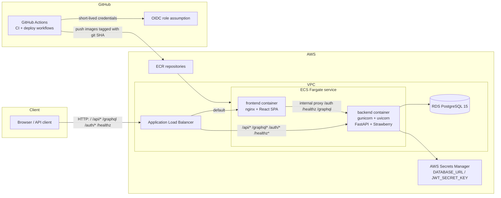
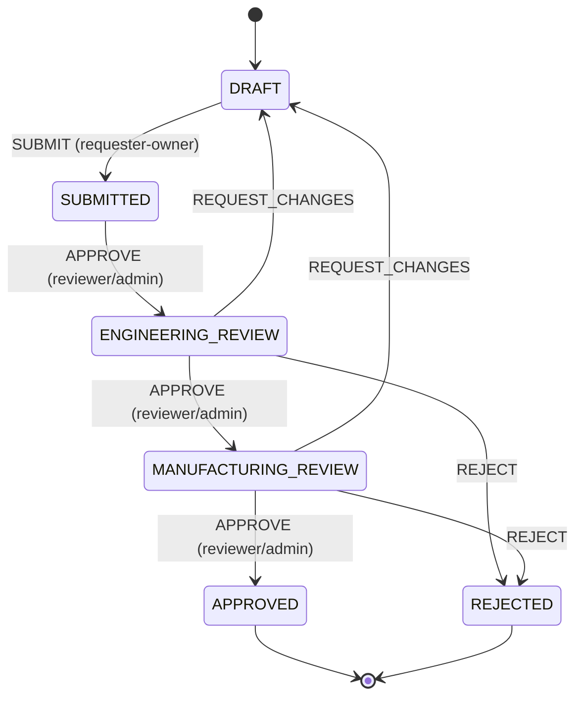

# ReleaseGate

Engineering change request (ECR) management with role-based review workflows,
append-only audit logging, and analytics-ready data. React + TypeScript frontend,
FastAPI + Strawberry GraphQL backend, PostgreSQL 15, deployed on AWS ECS Fargate.

## Architecture



- **Backend**: FastAPI (REST under `/api/v1`) + Strawberry GraphQL (`/graphql`),
  SQLAlchemy 2.x + Alembic, JWT auth, structured JSON logs with request ids.
- **Frontend**: Vite + React 18 + TypeScript (strict), TanStack Query with
  graphql-codegen typed hooks, plain CSS modules, Recharts.
- **CI/CD**: GitHub Actions runs ruff/mypy/pytest (coverage >= 80%), tsc/eslint/vitest,
  and a Playwright e2e job. On push to `main` (after CI passes) the deploy workflow
  assumes an AWS role via OIDC, pushes both images to ECR, and rolls out a new ECS
  task definition — gated on `/healthz`.

## Workflow state machine



Rules enforced by the pure state machine in `backend/app/workflow.py`:

- `HIGH` risk requires **two distinct reviewers** to approve at ENGINEERING_REVIEW.
- A reviewer may never approve the same request twice at the same stage, and may
  never approve their own request.
- Only the requester may edit a request, and only while it is DRAFT.
- Every transition is atomic: approval row + stage update + audit event commit together.

## Screens

| Screen          | Screenshot                                                      |
| --------------- | --------------------------------------------------------------- |
| Login           |                             |
| Requests list   |                       |
| Request detail  |           |
| New request     |                 |
| Analytics       |                     |

> Screenshot placeholders — drop real captures into `docs/screenshots/`.

## API surface

### REST (`/api/v1`, JWT `Authorization: Bearer`)

| Method | Path                                    | Description                                                  |
| ------ | --------------------------------------- | ------------------------------------------------------------ |
| POST   | `/auth/login`                           | `{ "email", "password" }` -> `{ "access_token", "token_type" }` |
| GET    | `/healthz`                              | `{"status":"ok","db":"ok"}` after a real `SELECT 1`          |
| GET    | `/api/v1/change-requests`               | List; filters `stage`, `risk_level`, `requester_id`, `subsystem`; offset pagination, sorted by `updated_at` desc |
| POST   | `/api/v1/change-requests`               | Create a request (starts in DRAFT)                           |
| GET    | `/api/v1/change-requests/{id}`          | Get one request                                              |
| PATCH  | `/api/v1/change-requests/{id}`          | Update fields; requester-owner only, DRAFT only              |
| POST   | `/api/v1/change-requests/{id}/transitions` | `{ "action": "SUBMIT\|APPROVE\|REQUEST_CHANGES\|REJECT", "comment" }` |
| GET    | `/api/v1/change-requests/{id}/audit`    | Full ordered audit trail                                     |
| GET    | `/api/v1/analytics/cycle-time`          | Per-stage dwell stats, current-stage counts, e2e latency, slowest stages |

### GraphQL (`/graphql`, GraphiQL in dev via `ENABLE_GRAPHIQL`)

- Queries: `me`, `changeRequest(id)`, `changeRequests(stage, riskLevel, subsystem, first, after)`
  (Relay-style connection with `pageInfo` and cursors), `cycleTimeAnalytics`
- Mutations: `createChangeRequest`, `updateChangeRequest`, `transitionChangeRequest(id, action, comment)`
- Workflow violations surface as GraphQL errors with `extensions.code`
  `PERMISSION_DENIED` (403) or `INVALID_TRANSITION` (409).
- Unauthenticated access is rejected except for `__schema` (introspection).
- Requester/reviewer/actor lookups go through DataLoaders (no N+1).

## Local development

### Quick start (Docker)

```sh
docker compose up --build
```

| Service  | URL                                    |
| -------- | -------------------------------------- |
| Frontend | http://localhost:3000                  |
| API docs | http://localhost:8003/docs             |
| GraphQL  | http://localhost:8003/graphql          |
| Health   | http://localhost:8003/healthz          |

Host ports are configurable via `DB_PORT`, `BACKEND_PORT`, and `FRONTEND_PORT`.
The backend entrypoint runs `alembic upgrade head` (and seeds when
`SEED_ON_STARTUP=true`, the compose default) before starting gunicorn.

### Seeded users

| Email                     | Role      | Password     |
| ------------------------- | --------- | ------------ |
| requester@releasegate.dev | REQUESTER | password123  |
| reviewer@releasegate.dev  | REVIEWER  | password123  |
| admin@releasegate.dev     | ADMIN     | password123  |

The seed creates 40 change requests (`ECR-1000` ... `ECR-1039`) spread across all
stages with timestamps backdated over 90 days, plus matching approvals and audit
events. It is idempotent and skipped on restart.

### Backend (uv)

```sh
cd backend
uv sync
uv run alembic upgrade head
uv run python -m app.seed
uv run uvicorn app.main:app --reload --port 8003
```

### Frontend

```sh
cd frontend
npm install
npm run dev
```

Vite proxies `/auth`, `/healthz`, and `/graphql` to `http://localhost:8003`.
GraphQL types/hooks are generated from `frontend/schema.graphql`; regenerate with
`npm run codegen` (also part of `npm run build`). `make schema` re-exports the SDL
from the backend and syncs it to the frontend.

## Testing

From the repo root:

```sh
make test   # backend pytest (coverage >= 80%, dockerized Postgres) + frontend vitest
make lint   # ruff + mypy + eslint + tsc --noEmit
make fmt    # ruff format + prettier
make e2e    # docker compose up -> Playwright -> down
```

Backend tests never use SQLite: the suite boots an ephemeral `postgres:15` Docker
container (or uses `TEST_DATABASE_URL` when provided, e.g. the CI service container),
runs Alembic migrations, and truncates tables between tests. Coverage targets the
state machine (`app/workflow.py`), the service/repository layer
(`app/repositories`), and the API layer (`app/routers`, `app/graphql`) — all >= 80%.

Frontend tests use Vitest + React Testing Library + MSW, and a Playwright end-to-end
test drives the real stack (requester creates/submits, reviewer approves through both
review stages).

## Deployment

### 1. Provision infrastructure (Terraform)

```sh
cd infra
cp terraform.tfvars.example terraform.tfvars   # fill in your values
terraform init
terraform plan -out=plan.out                   # review the plan
terraform apply plan.out
```

This creates the VPC, both ECR repositories, the ECS cluster/service/task
definition, the ALB (frontend target group + `/api`, `/graphql`, `/auth`,
`/healthz` routing to the backend target group), RDS Postgres, Secrets Manager
entries for `DATABASE_URL` and `JWT_SECRET_KEY`, and the GitHub OIDC provider with
the deploy role. No `.tfstate` or real ARNs are ever committed.

### 2. Wire up GitHub

```sh
terraform output -raw task_definition_json > infra/ecs-task-definition.json
```

Then set these repository **variables** (not secrets — the OIDC role provides
short-lived credentials; no long-lived keys):

| Variable                | Value                                            |
| ----------------------- | ------------------------------------------------ |
| `AWS_REGION`            | e.g. `us-east-1`                                 |
| `AWS_ACCOUNT_ID`        | your AWS account id                              |
| `AWS_DEPLOY_ROLE_ARN`   | `terraform output github_deploy_role_arn`        |
| `DEPLOY_HEALTH_URL`     | `http://$(terraform output -raw alb_dns_name)`   |

### 3. Ship

Push to `main`. CI runs the full test suite; when it passes, the deploy workflow
builds and pushes both images to ECR tagged with the git SHA, renders the ECS task
definition, deploys with `wait-for-service-stability`, and verifies `/healthz`
before reporting success.

## Results

Measured from the seeded dataset (40 change requests over a 90-day window):

| Metric                                    | Value          |
| ----------------------------------------- | -------------- |
| Change requests processed                 | 40             |
| Approvals recorded                        | 28             |
| Audit events appended                     | 127            |
| Average end-to-end approval latency       | 1,168.65 hours (~48.7 days) |
| Slowest stage                             | DRAFT (avg 390.23 h, median 375.19 h) |
| Current stage distribution                | 7 DRAFT / 7 SUBMITTED / 7 ENGINEERING_REVIEW / 7 MANUFACTURING_REVIEW / 7 APPROVED / 5 REJECTED |

## License

[MIT](LICENSE)
